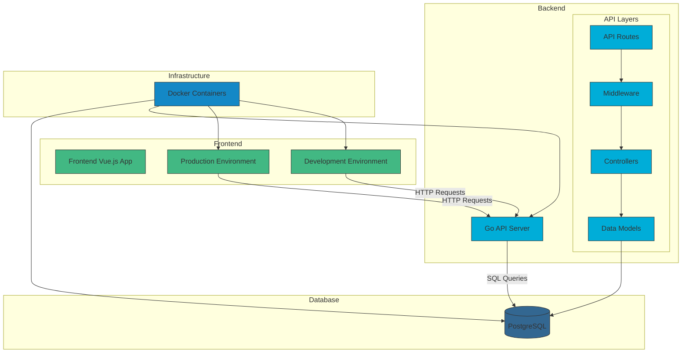

# Doctor Booking System Architecture

This document outlines the architecture of the Doctor Booking System.

## System Architecture Diagram

## Component Details

### Frontend
- **Technology**: Vue.js with TypeScript
- **Development Environment**: Hot-reloading enabled, runs on port 5173
- **Production Environment**: Nginx-served static files, runs on port 8081
- **Key Features**: User authentication, appointment booking, doctor profiles

### Backend
- **Technology**: Go (Golang)
- **API Structure**:
  - Routes: Define API endpoints
  - Middleware: Authentication, logging, error handling
  - Controllers: Business logic implementation
  - Models: Data structures and database interactions
- **Runs on port**: 8080

### Database
- **Technology**: PostgreSQL 13
- **Runs on port**: 5432
- **Stores**: User accounts, doctor profiles, appointments, etc.

### Infrastructure
- **Containerization**: Docker with docker-compose
- **Networks**: Bridge network for service communication
- **Volumes**: Persistent storage for database
